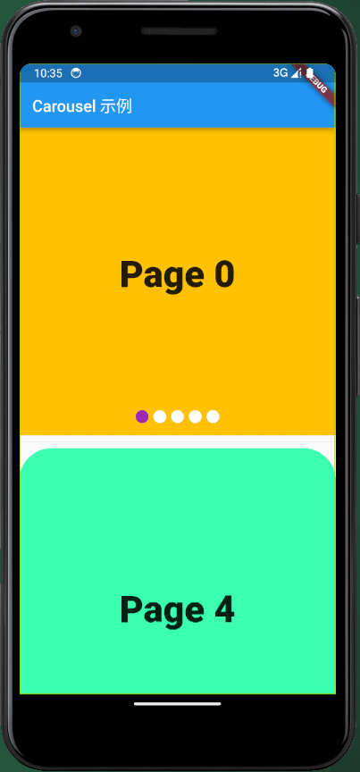

# awesome_carousel

A Flutter plug-in aimed at providing various carousel widgets.

## Author

- **Author**: [Juncai Li](https://blog.csdn.net/qq_28550263?spm=1011.2415.3001.5343)
- **Email**: [291148484@163.com](291148484@163.com)
- **License**: [MIT](http://thispage.tech:9680/jclee1995/flutter-carousels/-/blob/master/LICENSE)
- Repository: [http://thispage.tech:9680/jclee1995/flutter-carousels](http://thispage.tech:9680/jclee1995/flutter-carousels.git)
- 中文文档：[http://thispage.tech:9680/jclee1995/flutter-carousels/-/blob/master/README_CN.md](http://thispage.tech:9680/jclee1995/flutter-carousels/-/blob/master/README_CN.md)

## Getting Started

Carousel component provided in this module is very easy to realize carousel function in various demand scenarios, and developers can customize carousel related effects and carousel progress indicators.

Here are two examples of using Carousel's default carousel progress indicator:

```
import 'package:awesome_carousel/carousels.dart';
import 'package:flutter/material.dart';

class WidgetCarouselDemo extends StatelessWidget {
  const WidgetCarouselDemo({Key? key});

  @override
  Widget build(BuildContext context) {
    // Get the screen width and height
    final double width = MediaQuery.of(context).size.width;
    final double height = MediaQuery.of(context).size.height;

    // Define a list of colors for carousel items
    final List<Color> colors = [
      Colors.amber,
      Colors.blue,
      Colors.red,
      Colors.green,
      const Color.fromARGB(255, 59, 255, 177),
    ];

    // Create a list of widget units for the carousel
    List<Widget> units = [];

    for (var i = 0; i < colors.length; i++) {
      units.add(
        Container(
          width: width,
          height: height,
          decoration: BoxDecoration(
            color: colors[i],
          ),
          child: Center(
            child: Text(
              'Page $i',
              style: const TextStyle(
                fontSize: 46,
                fontWeight: FontWeight.w900,
              ),
            ),
          ),
        ),
      );
    }

    return Column(
      children: [
        // Create a horizontal carousel with circular indicators
        Carousel(
          units,
          indicatorShape: BoxShape.circle,
          indicatorWidth: 16,
          currentIndicatorColor: Colors.purple,
        ),
        const Divider(),
        // Create a vertical carousel with rectangular indicators
        ClipRRect(
          borderRadius: BorderRadius.circular(40.0), // Rounded corner radius
          child: Carousel(
            units.reversed.toList(),
            scrollDirection: Axis.vertical,
            indicatorShape: BoxShape.rectangle,
            indicatorWidth: 10,
            indicatorHeight: 10,
            currentIndicatorColor: Colors.pink,
            onUnitTapped: (index) => print('Carousel unit $index was tapped'),
            onIndicatorTapped: (index) => print('Progress indicator unit $index was tapped'),
          ),
        )
      ],
    );
  }
}
```

The effect is as follows:



In order to achieve more complex functions, it is necessary to define more parameters and use the carousel controller. The following is an example of customizing the carousel progress indicator style and using network pictures as carousel units.

```dart
import 'package:flutter/material.dart';
import 'package:awesome_carousel/carousels.dart';

class NetworkImageCarouselDemo extends StatelessWidget {
  final List<String> imageUrls;

  final CarouselController _controller;

  const NetworkImageCarouselDemo(
    this.imageUrls,
    this._controller, {
    super.key,
  });

  @override
  Widget build(BuildContext context) {
    return Column(
      children: [
        Carousel(
          _buildImages(context),
          height: 400.0, // 设置轮播图高度
          controller: _controller,
          indicatorColor: const Color.fromARGB(255, 190, 255, 130),
          // currentIndicatorColor: Colors.transparent,
          indicatorBuilder: _indicatorBuilder,
          // 当用户点击图像时触发的回调函数
          onUnitTapped: (int index) {
            print('点击了第 $index 张图片');
          },
        ),
        Row(
          mainAxisAlignment: MainAxisAlignment.center,
          children: [
            ElevatedButton(
              onPressed: () {
                _controller.toFirstPage();
              },
              child: const Text('首页'),
            ),
            const Spacer(
              flex: 1,
            ),
            ElevatedButton(
              onPressed: () {
                _controller.toPreviousPage();
              },
              child: const Text('上一页'),
            ),
            const Spacer(
              flex: 1,
            ),
            ElevatedButton(
              onPressed: () {
                _controller.toNextPage();
              },
              child: const Text('下一页'),
            ),
            const Spacer(
              flex: 1,
            ),
            ElevatedButton(
              onPressed: () {
                _controller.toLastPage();
              },
              child: const Text('尾页'),
            ),
          ],
        )
      ],
    );
  }

  List<Widget> _buildImages(BuildContext context) {
    List<Widget> res = [];
    for (String url in imageUrls) {
      res.add(
        Image.network(
          url,
          fit: BoxFit.cover, // 使图片宽度占满
          width: MediaQuery.of(context).size.width, // 设置宽度为屏幕宽度
          errorBuilder: (context, error, stackTrace) {
            // 在加载失败时返回一个占位图，确保图片占用固定高度
            return Container(
              height: MediaQuery.of(context).size.height,
              color: Colors.grey,
              child: Column(
                crossAxisAlignment: CrossAxisAlignment.start,
                children: [
                  const Text(
                    'Image loading error:',
                    style: TextStyle(
                      color: Colors.red,
                    ),
                  ),
                  Text(
                    "原因: $error\n追溯：$stackTrace",
                    style: const TextStyle(
                      color: Colors.white,
                    ),
                    maxLines: 9,
                    overflow: TextOverflow.ellipsis,
                  ),
                ],
              ),
            );
          },
        ),
      );
    }
    return res;
  }

  Map<String, Widget> _indicatorBuilder(int index) {
    return {
      'plain': Container(
        padding: const EdgeInsets.all(10),
        child: Column(
          children: [
            const Text(
              'plain',
              style: TextStyle(
                color: Colors.grey,
              ),
            ),
            Container(
              width: 30,
              height: 10,
              decoration: const BoxDecoration(color: Colors.white),
            ),
          ],
        ),
      ),
      'active': Container(
        padding: const EdgeInsets.all(10),
        child: Column(
          children: [
            const Icon(
              Icons.arrow_circle_down,
              color: Colors.amber,
            ),
            const Text(
              'active',
              style: TextStyle(
                color: Colors.red,
                fontSize: 20,
                fontWeight: FontWeight.w700,
              ),
            ),
            Container(
              width: 30,
              height: 10,
              decoration: BoxDecoration(
                color: switch (index) {
                  0 => Colors.blue,
                  1 => Colors.red,
                  2 => Colors.green,
                  3 => Colors.pink,
                  _ => Colors.purple,
                },
              ),
            ),
          ],
        ),
      )
    };
  }
}

```

The effect is as follows:


As you can see, because you can completely customize the carousel indicator and carousel items, as long as you have enough imagination, you can package some complex but exquisite carousels. For example, in the e-commerce scene, the first carousel unit is the introduction video of the goods, and the corresponding carousel indicator is the progress bar of the video, while the subsequent carousel unit is only the carousel picture. For example:


This can be easily realized by integrating the corresponding video player module with this module.

### Network Carousel

> Added in v1.0.0+1.  

A network carousel is a widely used form of carousel, especially in today's web applications, that displays a set of images in a cyclic manner. It is derived from the generic carousel class, `Carousel`, and is represented by the `NetImgCarousel` class. With `NetImgCarousel`, you can load a collection of images from URLs for a network carousel and customize various parameters related to images and the network.

Here is an example of how to use the `NetImgCarousel` class.

```dart
import 'package:flutter/material.dart';
import 'package:awesome_carousel/carousels.dart' show NetImgCarousel;

class NetImgCarouselExample extends StatelessWidget {
  final List<String> imageUrls = [
    'https://gitee.com/jacklee1995/example-pictures/raw/master/shoe/shoe1(1).png',
    'https://gitee.com/jacklee1995/example-pictures/raw/master/shoe/shoe1(3).png',
    'https://gitee.com/jacklee1995/example-pictures/raw/master/shoe/shoe1(5).png',
    'https://gitee.com/jacklee1995/example-pictures/raw/master/shoe/shoe1(7).png',
    'https://gitee.com/jacklee1995/example-pictures/raw/master/shoe/shoe1(2).png',
  ];

  NetImgCarouselExample({super.key});

  @override
  Widget build(BuildContext context) {
    return Center(
      child: NetImgCarousel(
        imageUrls,
        height: 400.0,
        indicatorColor: Colors.grey,
        currentIndicatorColor: Colors.blue,
        onUnitTapped: (index) {
          // Carousel unit callback event
          print('Tapped on unit $index');
        },
        onIndicatorTapped: (index) {
          // Carousel indicator callback event
          print('Tapped on indicator $index');
        },
      ),
    );
  }
}
```

The running result of the code is as follows:


The `NetImgCarousel` class allows you to create network carousels with ease, making it convenient to display a collection of images from web URLs.

The following table describes the parameters of the `netimgroom` constructor:

| Parameter Name                     | Type                        | Default Value          | Description                                                                             |
| ---------------------------------- | --------------------------- | ---------------------- | --------------------------------------------------------------------------------------- |
| `imageUrls`                        | `List<String>`              |                        | List of network image URLs to be displayed in the carousel.                             |
| `height`                           | `double`                    | `400.0`                | Height of the carousel component.                                                       |
| `width`                            | `double`                    | `0.0`                  | Width of the carousel component.                                                        |
| `useindicator`                     | `bool`                      | `true`                 | Whether to use indicators, defaults to `true`.                                          |
| `onUnitTapped`                     | `FunctionWithAInt?`         |                        | Callback function when a unit in the carousel is clicked, optional.                     |
| `onIndicatorTapped`                | `FunctionWithAInt?`         |                        | Callback function when an indicator is clicked, optional.                               |
| `indicatorBuilder`                 | `FunctionIndicatorBuilder?` |                        | Custom indicator builder function, optional.                                            |
| `indicatorColor`                   | `Color`                     | `Colors.white`         | Default indicator color.                                                                |
| `currentIndicatorColor`            | `Color`                     | `Colors.blue`          | Color of the currently selected indicator.                                              |
| `indicatorWidth`                   | `double`                    | `40.0`                 | Indicator width.                                                                        |
| `indicatorHeight`                  | `double`                    | `26.0`                 | Indicator height.                                                                       |
| `indicatorMargin`                  | `double`                    | `3.0`                  | Spacing between indicators.                                                             |
| `indicatorToBottom`                | `double`                    | `10.0`                 | Distance of indicators from the bottom.                                                 |
| `indicatorShape`                   | `BoxShape`                  | `BoxShape.rectangle`   | Default indicator shape.                                                                |
| `pageSnapping`                     | `bool`                      | `true`                 | Whether to enable page snapping, defaults to `true`.                                    |
| `padEnds`                          | `bool`                      | `true`                 | Whether to add extra pages at the beginning and end of the carousel, default is `true`. |
| `clipBehavior`                     | `Clip`                      | `Clip.hardEdge`        | The behavior for the clip.                                                              |
| `reverse`                          | `bool`                      | `false`                | Whether to reverse the order of items.                                                  |
| `scrollDirection`                  | `Axis`                      | `Axis.horizontal`      | The axis along which the page view scrolls.                                             |
| `controller`                       | `CarouselController?`       |                        | Carousel controller, optional.                                                          |
| `disableIndicatorDefaultCallbacks` | `bool`                      | `false`                | Whether to disable default indicator callback functions.                                |
| `imgScale`                         | `double`                    | `1.0`                  | Image scale factor, default is `1.0`.                                                   |
| `imgFrameBuilder`                  | `ImageFrameBuilder?`        |                        | Image frame builder, optional.                                                          |
| `imgLoadingBuilder`                | `ImageLoadingBuilder?`      |                        | Image loading builder, optional.                                                        |
| `imgErrorBuilder`                  | `ImageErrorWidgetBuilder?`  |                        | Image error widget builder, optional.                                                   |
| `imgExcludeFromSemantics`          | `bool`                      | `false`                | Whether to exclude the image from semantics, default is `false`.                        |
| `imgSemanticLabel`                 | `String?`                   |                        | Image semantic label, optional.                                                         |
| `imgWidth`                         | `double?`                   |                        | Image width, optional.                                                                  |
| `imgHeight`                        | `double?`                   |                        | Image height, optional.                                                                 |
| `imgColor`                         | `Color?`                    |                        | Image color, optional.                                                                  |
| `imgOpacity`                       | `Animation<double>?`        |                        | Image opacity, optional.                                                                |
| `imgColorBlendMode`                | `BlendMode?`                |                        | Image color blend mode, optional.                                                       |
| `imgFit`                           | `BoxFit?`                   |                        | Image fit, optional.                                                                    |
| `imgCenterSlice`                   | `Rect?`                     |                        | Image center slice, optional.                                                           |
| `imgAlignment`                     | `AlignmentGeometry`         | `Alignment.center`     | Image alignment, optional.                                                              |
| `imgRepeat`                        | `ImageRepeat`               | `ImageRepeat.noRepeat` | Image repeat mode, optional.                                                            |
| `imgMatchTextDirection`            | `bool`                      | `false`                | Whether the image should match the text direction, optional.                            |
| `imgGaplessPlayback`               | `bool`                      | `false`                | Whether to enable gapless playback for the image, optional.                             |
| `imgFilterQuality`                 | `FilterQuality`             | `FilterQuality.low`    | Image filter quality, optional.                                                         |
| `imgIsAntiAlias`                   | `bool`                      | `false`                | Whether the image should be anti-aliased, optional.                                     |
| `imgHeaders`                       | `Map<String, String>?`      |                        | Headers for the network image, optional.                                                |
| `imgCacheWidth`                    | `int?`                      |                        | Image cache width, optional.                                                            |
| `imgCacheHeight`                   | `int?`                      |                        | Image cache height, optional.                                                           |

### Local Image Carousel

> Added in v1.0.0+1. 

Local resource picture carousel is also a very common type of carousel. In Flutter, you need to configure the `assets` option of the `pubspec.yaml` file first to ensure that your pictures can be loaded normally.

Here's a simple example:

```dart
import 'package:flutter/material.dart';
import 'package:awesome_carousel/img_carousels/assert_img_carousel.dart';

class AssetImgCarouselExample extends StatelessWidget {
  final List<String> assetImagePaths = [
    'assets/image1.png',
    'assets/image2.png',
    'assets/image3.png',
  ];

  AssetImgCarouselExample({super.key});

  @override
  Widget build(BuildContext context) {
    return Center(
      child: AssetImgCarousel(
        assetImagePaths,
        height: 400.0,
        indicatorColor: Colors.grey,
        currentIndicatorColor: Colors.blue,
        indicatorShape: BoxShape.circle,
        onUnitTapped: (index) {
          print('Tapped on unit $index');
        },
        onIndicatorTapped: (index) {
          print('Tapped on indicator $index');
        },
      ),
    );
  }
}
```

The code produces the following result:


The table below describes the parameters of the `AssetImgCarousel` constructor:

| Parameter Name                   | Parameter Type            | Description                                                                           |
| -------------------------------- | ------------------------- | ------------------------------------------------------------------------------------- |
| assetImagePaths                  | List<String>              | List of asset image file paths for the carousel.                                      |
| height                           | double                    | Height of the carousel component.                                                     |
| width                            | double                    | Width of the carousel component.                                                      |
| useindicator                     | bool                      | Whether to use indicators, defaults to true.                                          |
| onUnitTapped                     | FunctionWithAInt?         | Callback function when a unit in the carousel is clicked, optional.                   |
| onIndicatorTapped                | FunctionWithAInt?         | Callback function when an indicator is clicked, optional.                             |
| indicatorBuilder                 | FunctionIndicatorBuilder? | Custom indicator builder function, optional.                                          |
| indicatorColor                   | Color                     | Default indicator color.                                                              |
| currentIndicatorColor            | Color                     | Color of the currently selected indicator.                                            |
| indicatorWidth                   | double                    | Indicator width.                                                                      |
| indicatorHeight                  | double                    | Indicator height.                                                                     |
| indicatorMargin                  | double                    | Spacing between indicators.                                                           |
| indicatorToBottom                | double                    | Distance of indicators from the bottom.                                               |
| indicatorShape                   | BoxShape                  | Default indicator shape, defaults to a rectangle.                                     |
| pageSnapping                     | bool                      | Whether to enable page snapping, defaults to true.                                    |
| padEnds                          | bool                      | Whether to add extra pages at the beginning and end of the carousel, default is true. |
| clipBehavior                     | Clip                      | The behavior for the clip.                                                            |
| reverse                          | bool                      | Whether to reverse the order of items.                                                |
| scrollDirection                  | Axis                      | The axis along which the page view scrolls.                                           |
| controller                       | CarouselController?       | Carousel controller, optional.                                                        |
| disableIndicatorDefaultCallbacks | bool                      | Whether to disable default indicator callback functions.                              |
| imgScale                         | double                    | Image scale factor.                                                                   |
| imgFrameBuilder                  | ImageFrameBuilder?        | Custom image frame builder, optional.                                                 |
| imgExcludeFromSemantics          | bool                      | Whether the image should be excluded from semantics, default is false.                |
| imgAlignment                     | AlignmentGeometry         | Alignment of the image within its frame.                                              |
| imgRepeat                        | ImageRepeat               | How the image should repeat.                                                          |
| imgMatchTextDirection            | bool                      | Whether the image should match the text direction.                                    |
| imgGaplessPlayback               | bool                      | Whether to enable gapless playback of images, default is false.                       |
| imgFilterQuality                 | FilterQuality             | The filter quality for the image, default is FilterQuality.low.                       |
| imgIsAntiAlias                   | bool                      | Whether the image should be anti-aliased.                                             |
| imgErrorBuilder                  | ImageErrorWidgetBuilder?  | Custom image error widget builder, optional.                                          |
| imgSemanticLabel                 | String?                   | Semantic label for the image, optional.                                               |
| imgWidth                         | double?                   | Image width, optional.                                                                |
| imgHeight                        | double?                   | Image height, optional.                                                               |
| imgColor                         | Color?                    | Color applied to the image, optional.                                                 |
| imgOpacity                       | Animation<double>?        | Image opacity, optional.                                                              |
| imgColorBlendMode                | BlendMode?                | Blend mode applied to the image, optional.                                            |
| imgFit                           | BoxFit?                   | How the image fits within its frame, optional.                                        |
| imgCenterSlice                   | Rect?                     | The center slice for the image, optional.                                             |
| imgHeaders                       | Map<String, String>?      | Headers for network image requests, optional.                                         |
| imgCacheWidth                    | int?                      | Maximum width for image caching, optional.                                            |
| imgCacheHeight                   | int?                      | Maximum height for image caching, optional.                                           |
| imgPackage                       | String?                   | Package name for the image, optional.                                                 |

## API

### Class CarouselController

The `CarouselController` class is used to manage carousel control. It includes multiple methods for controlling carousel navigation, animations, and status notifications.

#### Constructor

```dart
CarouselController(
  int total, {
  int initialPage = 0,
  bool keepPage = true,
  double viewportFraction = 1.0,
  Curve curve = Curves.ease,
  Duration duration = const Duration(milliseconds: 300),
})
```

##### Parameters

- `total` (int): Represents the total number of pages in the carousel.
- `initialPage` (int): Represents the initial page index, defaulting to 0.
- `keepPage` (bool): Indicates whether to keep the page's state after navigating, with a default of `true`.
- `viewportFraction` (double): Represents the fraction of the page width that is visible in the viewport, with a default of 1.0.
- `curve` (Curve): Represents the animation curve for page transitions, defaulting to `Curves.ease`.
- `duration` (Duration): Represents the duration of the page transition animation, with a default of `Duration(milliseconds: 300)`.

#### Methods

##### `goToPage(int page)`

This method is used to navigate to a specific page within the carousel using a custom method.

- `page` (int): The index of the page to navigate to.

##### `toFirstPage()`

This method is used to navigate to the first page within the carousel using a custom method.

##### `toPreviousPage()`

This method is used to navigate to the previous page within the carousel using a custom method. If the current page is already the first page, it will navigate to the last page.

##### `toNextPage()`

This method is used to navigate to the next page within the carousel using a custom method. If the current page is already the last page, it will navigate to the first page.

##### `toLastPage()`

This method is used to navigate to the last page within the carousel using a custom method.

#### Properties

##### `currentPage`

- Type: int
- Description: Gets or sets the current page index of the carousel. By getting the `currentPage` property, you can obtain the current page index. By setting the `currentPage` property, you can navigate to a specific page.

### Example

```dart
final controller = CarouselController(3);

// Get the current page index
int current = controller.currentPage;

// Navigate to the second page
controller.goToPage(1);

// Navigate to the next page
controller.toNextPage();
```

## Class Carousel

The `Carousel` class is a versatile carousel component that allows you to create various types of carousels in your Flutter application. You can configure the appearance of the carousel, control its behavior, and define callback functions.

#### Constructor

```dart
Carousel(
  List<Widget> units, {
  Key? key,
  double height = 400.0,
  double width = 0.0,
  FunctionWithAInt? onUnitTapped,
  FunctionWithAInt? onIndicatorTapped,
  bool useindicator = true,
  Color indicatorColor = Colors.white,
  Color currentIndicatorColor = Colors.blue,
  double indicatorWidth = 40.0,
  double indicatorHeight = 26.0,
  double indicatorMargin = 3.0,
  double indicatorToBottom = 10.0,
  BoxShape indicatorShape = BoxShape.rectangle,
  FunctionIndicatorBuilder? indicatorBuilder,
  bool pageSnapping = true,
  bool padEnds = true,
  Clip clipBehavior = Clip.hardEdge,
  bool reverse = false,
  Axis scrollDirection = Axis.horizontal,
  CarouselController? controller,
})
```

##### Parameters

- `units` (List\<Widget>): The list of components to be displayed in the carousel.
- `key` (Key?): An optional parameter used to identify the widget in the widget tree.
- `height` (double): The height of the carousel component, with a default value of 400.0.
- `width` (double): The width of the carousel component, with a default of 0.0 (auto-adapts to screen width).
- `onUnitTapped` (FunctionWithAInt?): A callback function triggered when a carousel unit is tapped. It is optional and receives an integer parameter representing the tapped unit's index.
- `onIndicatorTapped` (FunctionWithAInt?): A callback function triggered when an indicator is tapped. It is optional and receives an integer parameter representing the tapped indicator's index.
- `useindicator` (bool): Controls whether to display indicators beneath the carousel. The default value is `true`.
- `indicatorColor` (Color): The default color of the indicators, defaulting to white.
- `currentIndicatorColor` (Color): The color of the indicator for the currently selected page, defaulting to blue.
- `indicatorWidth` (

double): The width of each indicator, with a default of 40.0.

- `indicatorHeight` (double): The height of each indicator, with a default of 26.0.
- `indicatorMargin` (double): The horizontal margin between indicators, with a default of 3.0.
- `indicatorToBottom` (double): The distance of the indicators from the bottom, with a default of 10.0.
- `indicatorShape` (BoxShape): The shape of the indicators, which can be either `BoxShape.rectangle` or `BoxShape.circle`. The default is `BoxShape.rectangle`.
- `indicatorBuilder` (FunctionIndicatorBuilder?): A custom indicator builder function that allows you to define custom appearances for the indicators.
- `pageSnapping` (bool): Controls whether to enable page snapping, with a default value of `true`.
- `padEnds` (bool): Controls whether to add additional pages at the beginning and end of the carousel, with a default of `true`.
- `clipBehavior` (Clip): Specifies how to clip the content of carousel units, defaulting to `Clip.hardEdge`.
- `reverse` (bool): Controls whether to scroll through carousel units in reverse order, with a default value of `false`.
- `scrollDirection` (Axis): Specifies the direction in which carousel units are scrolled, which can be `Axis.horizontal` or `Axis.vertical`, with a default of `Axis.horizontal`.
- `controller` (CarouselController?): An optional carousel controller used to control the behavior and state of the carousel.
- `disableIndicatorDefaultCallbacks` (bool): Specifies whether to disable the default indicator callback functions. The default value is `false`. When set to `true`, default indicator click events are not executed.

#### Example

```dart
Carousel(
  [
    Image.network('https://example.com/image1.jpg'),
    Image.network('https://example.com/image2.jpg'),
    Image.network('https://example.com/image3.jpg'),
  ],
  height: 300.0,
  onUnitTapped: (int index) {
    print('Tapped unit at index $index');
  },
  indicatorColor: Colors.red,
  currentIndicatorColor: Colors.green,
)
```

### class NetImgCarousel

> Added in v1.0.0+1.

See above.


### class AssetImgCarousel

> Added in v1.0.0+1.

See above.
