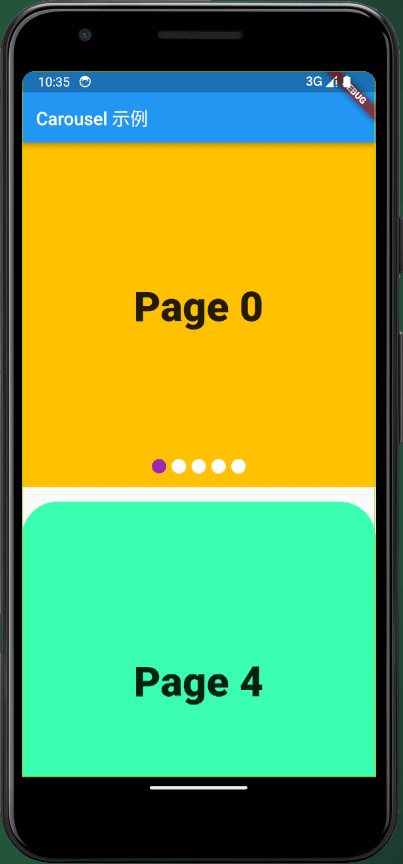

# awesome_carousel

一款旨在提供各种轮播组件的 Flutter 插件。

## 作者信息

- **作者**：[李俊才](https://blog.csdn.net/qq_28550263?spm=1011.2415.3001.5343)
- **邮箱**：[291148484@163.com](291148484@163.com)
- **协议**：[MIT](http://thispage.tech:9680/jclee1995/flutter_money_display/-/blob/master/LICENSE)
- 项目仓库：[http://thispage.tech:9680/jclee1995/flutter_money_display](http://thispage.tech:9680/jclee1995/flutter_money_display.git)
- English Document: [https://github.com/jacklee1995/flutter-carousels/blob/master/README.md](https://github.com/jacklee1995/flutter-carousels/blob/master/README.md)

## 开始

本模块提供的 Carousel 组件十分容易实现多种需求场景下的轮播功能，开发者可以定制轮播相关效果和轮播进度指示器。

下面是两个使用 Carousel 组件默认的轮播进度指示器的例子：

```dart
import 'package:awesome_carousel/carousels.dart';
import 'package:flutter/material.dart';

class WidgetCarouSelDemo extends StatelessWidget {
  const WidgetCarouSelDemo({super.key});

  @override
  Widget build(BuildContext context) {
    final double width = MediaQuery.of(context).size.width;
    final double height = MediaQuery.of(context).size.height;
    final List<Color> colors = [
      Colors.amber,
      Colors.blue,
      Colors.red,
      Colors.green,
      const Color.fromARGB(255, 59, 255, 177),
    ];

    List<Widget> units = [];

    for (var i = 0; i < colors.length; i++) {
      units.add(
        Container(
          width: width,
          height: height,
          decoration: BoxDecoration(
            color: colors[i],
          ),
          child: Center(
            child: Text(
              'Page $i',
              style: const TextStyle(
                fontSize: 46,
                fontWeight: FontWeight.w900,
              ),
            ),
          ),
        ),
      );
    }

    return Column(
      children: [
        Carousel(
          units,
          indicatorShape: BoxShape.circle,
          indicatorWidth: 16,
          currentIndicatorColor: Colors.purple,
        ),
        const Divider(),
        ClipRRect(
          borderRadius: BorderRadius.circular(40.0), // 圆角半径
          child: Carousel(
            units.reversed.toList(),
            scrollDirection: Axis.vertical,
            indicatorShape: BoxShape.rectangle,
            indicatorWidth: 10,
            indicatorHeight: 10,
            currentIndicatorColor: Colors.pink,
            onUnitTapped: (index) => print('轮播单元 $index 被点击了'),
            onIndicatorTapped: (index) => print('进度指示单元 $index 被点击了'),
          ),
        )
      ],
    );
  }
}

```

其效果如下：



为了实现更加复杂的功能，需要定义更多的参数，以及使用轮播控制器。下面是一个自定义轮播进度指示器样式，并使用网络图片作为轮播单元的例子。

```dart
import 'package:flutter/material.dart';
import 'package:awesome_carousel/carousels.dart';

class NetworkImageCarouselDemo extends StatelessWidget {
  final List<String> imageUrls;

  final CarouselController _controller;

  const NetworkImageCarouselDemo(
    this.imageUrls,
    this._controller, {
    super.key,
  });

  @override
  Widget build(BuildContext context) {
    return Column(
      children: [
        Carousel(
          _buildImages(context),
          height: 400.0, // 设置轮播图高度
          controller: _controller,
          indicatorColor: const Color.fromARGB(255, 190, 255, 130),
          // currentIndicatorColor: Colors.transparent,
          indicatorBuilder: _indicatorBuilder,
          // 当用户点击图像时触发的回调函数
          onUnitTapped: (int index) {
            print('点击了第 $index 张图片');
          },
        ),
        Row(
          mainAxisAlignment: MainAxisAlignment.center,
          children: [
            ElevatedButton(
              onPressed: () {
                _controller.toFirstPage();
              },
              child: const Text('首页'),
            ),
            const Spacer(
              flex: 1,
            ),
            ElevatedButton(
              onPressed: () {
                _controller.toPreviousPage();
              },
              child: const Text('上一页'),
            ),
            const Spacer(
              flex: 1,
            ),
            ElevatedButton(
              onPressed: () {
                _controller.toNextPage();
              },
              child: const Text('下一页'),
            ),
            const Spacer(
              flex: 1,
            ),
            ElevatedButton(
              onPressed: () {
                _controller.toLastPage();
              },
              child: const Text('尾页'),
            ),
          ],
        )
      ],
    );
  }

  List<Widget> _buildImages(BuildContext context) {
    List<Widget> res = [];
    for (String url in imageUrls) {
      res.add(
        Image.network(
          url,
          fit: BoxFit.cover, // 使图片宽度占满
          width: MediaQuery.of(context).size.width, // 设置宽度为屏幕宽度
          errorBuilder: (context, error, stackTrace) {
            // 在加载失败时返回一个占位图，确保图片占用固定高度
            return Container(
              height: MediaQuery.of(context).size.height,
              color: Colors.grey,
              child: Column(
                crossAxisAlignment: CrossAxisAlignment.start,
                children: [
                  const Text(
                    'Image loading error:',
                    style: TextStyle(
                      color: Colors.red,
                    ),
                  ),
                  Text(
                    "原因: $error\n追溯：$stackTrace",
                    style: const TextStyle(
                      color: Colors.white,
                    ),
                    maxLines: 9,
                    overflow: TextOverflow.ellipsis,
                  ),
                ],
              ),
            );
          },
        ),
      );
    }
    return res;
  }

  Map<String, Widget> _indicatorBuilder(int index) {
    return {
      'plain': Container(
        padding: const EdgeInsets.all(10),
        child: Column(
          children: [
            const Text(
              'plain',
              style: TextStyle(
                color: Colors.grey,
              ),
            ),
            Container(
              width: 30,
              height: 10,
              decoration: const BoxDecoration(color: Colors.white),
            ),
          ],
        ),
      ),
      'active': Container(
        padding: const EdgeInsets.all(10),
        child: Column(
          children: [
            const Icon(
              Icons.arrow_circle_down,
              color: Colors.amber,
            ),
            const Text(
              'active',
              style: TextStyle(
                color: Colors.red,
                fontSize: 20,
                fontWeight: FontWeight.w700,
              ),
            ),
            Container(
              width: 30,
              height: 10,
              decoration: BoxDecoration(
                color: switch (index) {
                  0 => Colors.blue,
                  1 => Colors.red,
                  2 => Colors.green,
                  3 => Colors.pink,
                  _ => Colors.purple,
                },
              ),
            ),
          ],
        ),
      )
    };
  }
}
```

其效果如下：


可以看到，由于可以完全自定义轮播指示器和轮播项，只要你拥有足够丰富的想象力，可以包装出一些复杂但精致的轮播。例如在电商场景下，第一个轮播单元是商品的介绍视频，对应的轮播指示器是视频的进度条，而后续的轮播单元仅仅是轮播图片。比如：


这可以很容易地使用相应地视频播放器模块与本模块集成实现。

## API

### CarouselController 类

`CarouselController` 类是一个用于管理轮播图控制的类。它包含了多个方法，用于控制轮播图的跳转、动画效果和状态通知。

#### 构造函数

```dart
CarouselController(
  int total, {
  int initialPage = 0,
  bool keepPage = true,
  double viewportFraction = 1.0,
  Curve curve = Curves.ease,
  Duration duration = const Duration(milliseconds: 300),
})
```

##### 参数

- `total` (int): 表示轮播的总页面数量。
- `initialPage` (int): 表示初始页面索引，默认为0。
- `keepPage` (bool): 表示是否保持页面，即在翻页后是否保存页面状态，默认为 `true`。
- `viewportFraction` (double): 表示可视视口占整个页面宽度的比例，默认为 1.0。
- `curve` (Curve): 页面切换动画曲线，默认为 `Curves.ease`。
- `duration` (Duration): 页面切换动画播放时间，默认为 `Duration(milliseconds: 300)`。

#### 方法

##### `goToPage(int page)`

此方法用于通过自定义方法滚动轮播到指定的页面。

- `page` (int): 要跳转到的页面的索引。

##### `toFirstPage()`

此方法用于通过自定义方法将轮播滚动到第一个页面。

##### `toPreviousPage()`

此方法用于通过自定义方法将轮播滚动到上一页。如果当前已经是第一页，则会跳转到最后一页。

##### `toNextPage()`

此方法用于通过自定义方法将轮播滚动到下一页。如果当前已经是最后一页，则会跳转到第一页。

##### `toLastPage()`

此方法用于通过自定义方法将轮播滚动到最后一页。

#### 属性

#### `currentPage`

- 类型: int
- 描述: 获取或设置当前轮播的页面索引。通过获取 `currentPage` 属性，可以获得当前页面的索引，通过设置 `currentPage` 属性，可以跳转到指定的页面。

### 示例

```dart
final controller = CarouselController(3);

// 获取当前页面索引
int current = controller.currentPage;

// 将轮播滚动到第二页
controller.goToPage(1);

// 将轮播滚动到下一页
controller.toNextPage();
```

## Carousel 类

`Carousel` 类是一个通用的轮播组件，它允许您在Flutter应用程序中创建各种类型的轮播图。您可以配置轮播图的外观、轮播控制和回调函数。

### 构造函数

```dart
Carousel(
  List<Widget> units, {
  Key? key,
  double height = 400.0,
  double width = 0.0,
  FunctionWithAInt? onUnitTapped,
  FunctionWithAInt? onIndicatorTapped,
  bool useindicator = true,
  Color indicatorColor = Colors.white,
  Color currentIndicatorColor = Colors.blue,
  double indicatorWidth = 40.0,
  double indicatorHeight = 26.0,
  double indicatorMargin = 3.0,
  double indicatorToBottom = 10.0,
  BoxShape indicatorShape = BoxShape.rectangle,
  FunctionIndicatorBuilder? indicatorBuilder,
  bool pageSnapping = true,
  bool padEnds = true,
  Clip clipBehavior = Clip.hardEdge,
  bool reverse = false,
  Axis scrollDirection = Axis.horizontal,
  CarouselController? controller,
})
```

#### 参数

- `units` (List\<Widget>): 要轮播的组件列表。
- `key` (Key?): 可选参数，用于在小部件树中标识小部件。
- `height` (double): 轮播组件的高度，默认为 400.0。
- `width` (double): 轮播组件的宽度，默认为 0.0（自动适应屏幕宽度）。
- `onUnitTapped` (FunctionWithAInt?): 当轮播单元被点击时触发的回调函数，可选，接收一个整数参数，表示被点击的单元索引。
- `onIndicatorTapped` (FunctionWithAInt?): 当指示器被点击时触发的回调函数，可选，接收一个整数参数，表示被点击的指示器索引。
- `useindicator` (bool): 控制是否显示轮播图下方的指示器，默认为 `true`。
- `indicatorColor` (Color): 指示器的默认颜色，默认为白色。
- `currentIndicatorColor` (Color): 当前选中指示器的颜色，默认为蓝色。
- `indicatorWidth` (double): 每个指示器的宽度，默认为 40.0。
- `indicatorHeight` (double): 每个指示器的高度，默认为 26.0。
- `indicatorMargin` (double): 指示器之间的水平间距，默认为 3.0。
- `indicatorToBottom` (double): 指示器距离底部的距离，默认为 10.0。
- `indicatorShape` (BoxShape): 指示器的形状，可以是 `BoxShape.rectangle` 或 `BoxShape.circle`，默认为 `BoxShape.rectangle`。
- `indicatorBuilder` (FunctionIndicatorBuilder?): 自定义指示器构建函数，可选，用于创建指示器的自定义外观。
- `pageSnapping` (bool): 是否启用页面快速吸附，默认为 `true`。
- `padEnds` (bool): 是否在轮播首尾添加额外的页面，默认为 `true`。
- `clipBehavior` (Clip): 指示如何剪切轮播单元的内容，默认为 `Clip.hardEdge`。
- `reverse` (bool): 是否以反向顺序滚动轮播单元，默认为 `false`。
- `scrollDirection` (Axis): 轮播单元滚动方向，可以是 `Axis.horizontal` 或 `Axis.vertical`，默认为 `Axis.horizontal`。
- `controller` (CarouselController?): 轮播控制器，可选，用于控制轮播的行为和状态。
- `disableIndicatorDefaultCallbacks` (bool): 是否禁用默认指示器回调函数，默认为 `false`。当为 `true` 时，不执行默认的指示器点击事件。

### 示例

```dart
Carousel(
  [
    Image.network('https://example.com/image1.jpg'),
    Image.network('https://example.com/image2.jpg'),
    Image.network('https://example.com/image3.jpg'),
  ],
  height: 300.0,
  onUnitTapped: (int index) {
    print('点击了第 $index 个轮播单元');
  },
  indicatorColor: Colors.red,
  currentIndicatorColor: Colors.green,
),
```
